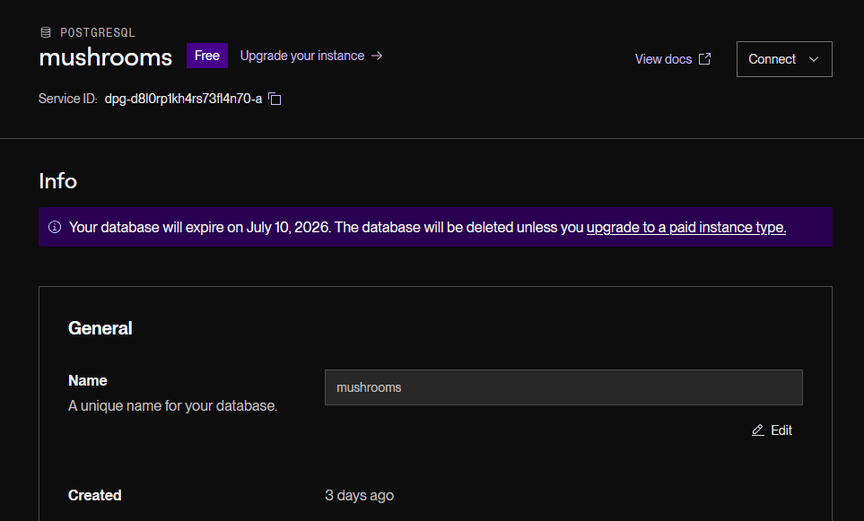
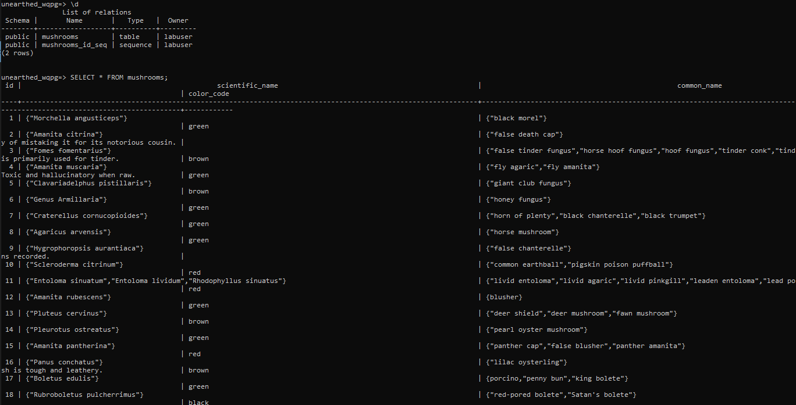

# WEB103 Project 1 - *Mushroom Friend*

Submitted by: **Tatiana Vela**

About this web app: **Mushroom database**

Time spent: **5** hours

## Required Features

The following **required** functionality is completed:

<!-- Make sure to check off completed functionality below -->
- [x] **The web app uses only HTML, CSS, and JavaScript without a frontend framework**
- [x] **The web app is connected to a PostgreSQL database, with an appropriately structured database table for the list items**
  - [x] **NOTE: Your walkthrough added to the README must include a view of your Render dashboard demonstrating that your Postgres database is available**
  - [x]  **NOTE: Your walkthrough added to the README must include a demonstration of your table contents. Use the psql command 'SELECT * FROM tablename;' to display your table contents.**

## Video Walkthrough

Here's a walkthrough of implemented required features:

Front end

render dashboard

terminal query showing contents of database

GIF created with [ScreenToGif](https://www.screentogif.com/) for Windows  GIF tool here
